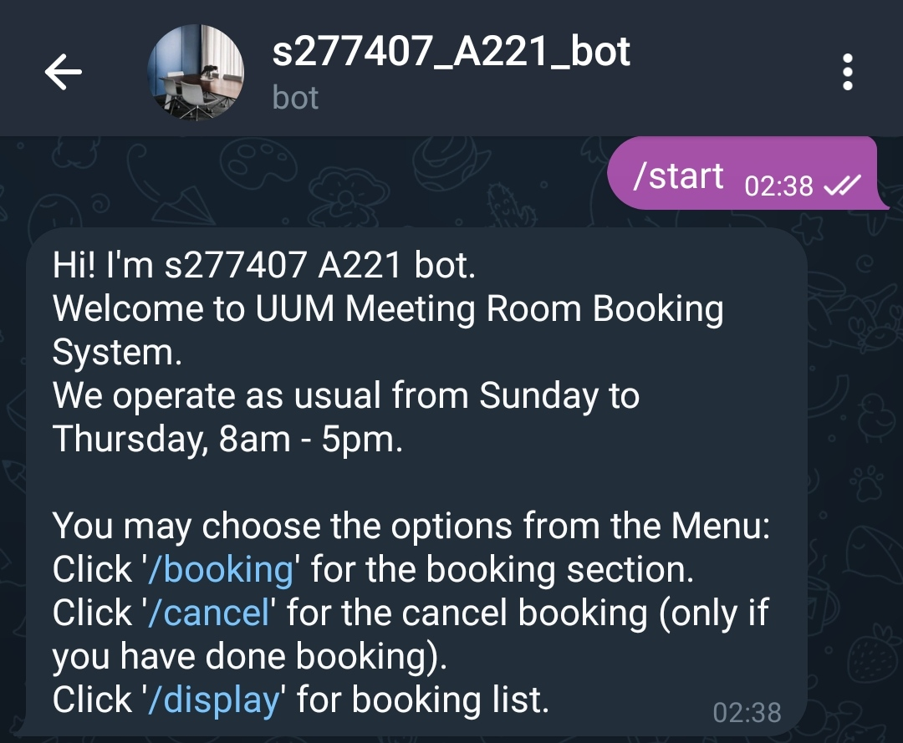
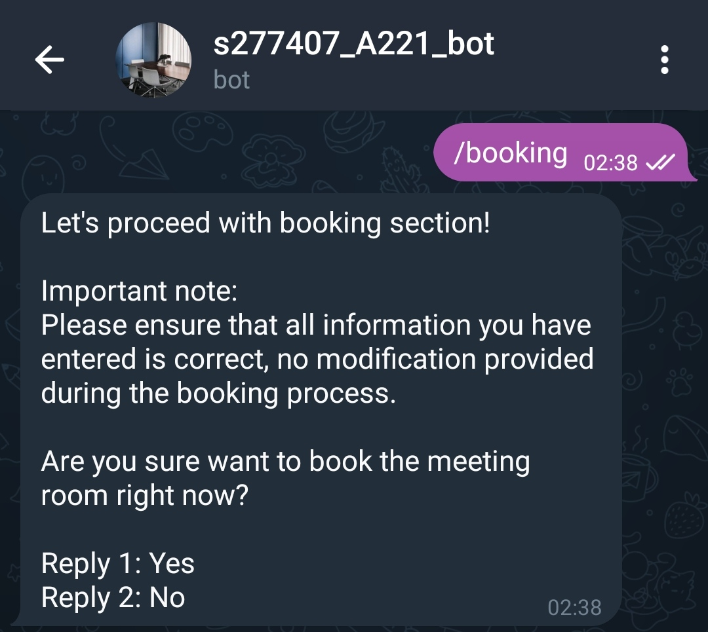
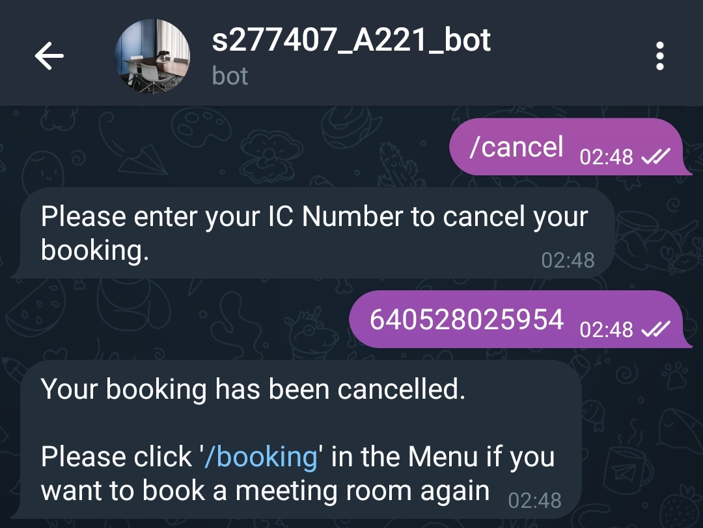
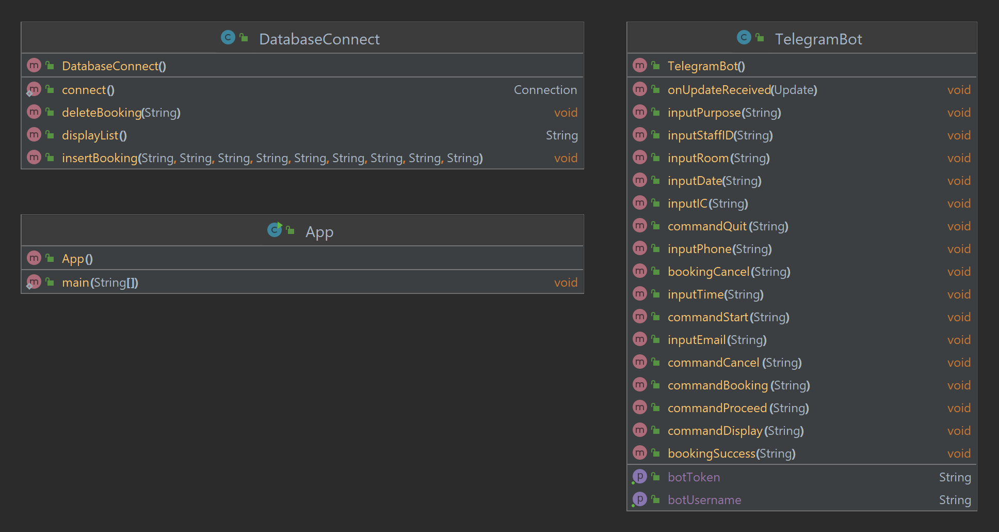
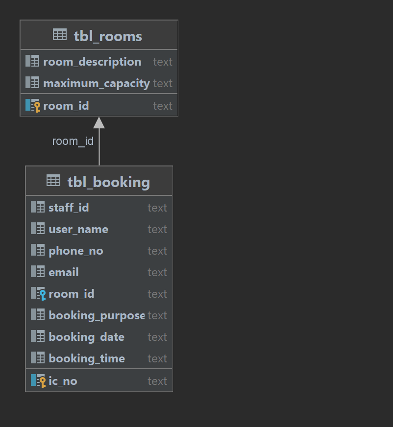

## Requirements for Assignment-2
[Read the instruction](https://github.com/STIW3054-A221/class-activity-soc/blob/main/Assignment-2.md)

## Your Info:
1. Matric Number & Name & Photo & Phone Number
2. Other related info (if any)

 Name: Tan Xue Lee
 Matric No: 277407
 Phone No: 010-3118728

## Introduction
This Java program is to create a Telegram Bots by using MAVEN. There are 1 main class which is Class App, and 2 extra classes which are Class TelegramBot, and Class DatabaseConnect. Class App is used to register and link with Telegram API so that Telegram Bots can be run successfully. Class TelegramBot is used to send message and receive message by using BotUsername and BotToken. Class DatabaseConnect is used to link to SQLite database so that the data can be inserted, deleted, and selected.
  
This Telegram Bots is created for Meeting Room Booking System which is named as s277407_A221_bot. Users can book a meeting room through this bot by answering to the bot about their personal information and booking details. Users can quit the booking process immediately if they suddenly do not want to proceed. Users can also cancel their booking by providing their IC number. Users can view the booking list also.

## Flow Diagram of the requirements (Use: https://app.diagrams.net/)

## Result/Output (Screenshot of the output)
Command '/start' (Main menu):
 

Command '/booking' (Booking for meeting room):
 

Reply '1' (proceed to booking section):
 

Reply '2' (quit from booking section):
 

Reply '0' during booking process (quit from booking section):
 

Normal flow
 
(User need to input name, IC number, staff ID, phone number, email, room type, booking purpose, booking date, and booking time. Bot will display the booking details for particular user after booking):
 

 

 

 

Command '/display' (display booking list):
 

 

Command '/cancel' (cancel booking):
 

## UML Class Diagram

## Database design

## Youtube Presentation
[https://youtu.be/2cfsAiJm1Bc](https://youtu.be/2cfsAiJm1Bc)

## References (Not less than 10)
Amit Thinks (2022). How to install SQLite on Windows 10 | 2022 | Amit Thinks. https://www.youtube.com/watch?v=L3FwRRx6bqo

Azamat Ordabekov (2021). How to create Telegram Bot in Java. https://www.youtube.com/watch?v=XjOnp8TVNSQ

Code Java (2020). Java Connect to SQLite Database Example. https://www.youtube.com/watch?v=293M9-QRZ0c&t=884s

GeeksforGeeks (2022). HashMap in Java with Examples. https://www.geeksforgeeks.org/java-util-hashmap-in-java-with-examples/

RedSysTech (2021). # 111 Internal Working of HashMap in Java | How HashMap works internally in java | Java | RedSysTech. https://www.youtube.com/watch?v=HArvh9AZ1IE

rubenlagus (2022). Telegram Bot Java Library. https://github.com/rubenlagus/TelegramBots

Shift Academy (2022). Java telegram bot PRO!. https://www.youtube.com/watch?v=qdrCGjskHKQ

SQLite Tutorial (2022). SQLite Inner Join. https://www.sqlitetutorial.net/sqlite-inner-join/

SQLite Tutorial (2022). SQLite Java: Deleting Data. https://www.sqlitetutorial.net/sqlite-java/delete/

SQLite Tutorial (2022). SQLite Java: Inserting Data. https://www.sqlitetutorial.net/sqlite-java/insert/

SQLite Tutorial (2022). SQLite Java: Select Data. https://www.sqlitetutorial.net/sqlite-java/select/

Telegram (n.d.). Bot API Library Examples. Telegram APIs. https://core.telegram.org/bots/samples

W3Schools Online Web Tutorials (n.d.). Java HashMap. https://www.w3schools.com/java/java_hashmap.asp

Zaur Hasanov (2018). How to create Telegram Bot in Java (Tutorial). https://www.youtube.com/watch?v=xv-FYOizUSY

## JavaDoc
[https://tanxuelee.github.io/JavaDocAssignment2/index.html?_ijt=nplmqq8g0hr36ckuv2g1fo36e8&_ij_reload=RELOAD_ON_SAVE](https://tanxuelee.github.io/JavaDocAssignment2/index.html?_ijt=nplmqq8g0hr36ckuv2g1fo36e8&_ij_reload=RELOAD_ON_SAVE)

